# PIC18F Mini-Sumo Robot

Wireless mini-sumo robot developed with **PIC18 microcontrollers**, Bluetooth/UART communication, joystick control, dual-motor PWM, and custom PCB electronics.

## 2nd Place — Robot Sumo, ROBOUAQ 2023

The robot obtained **2nd place in the Robot Sumo category at ROBOUAQ 2023**, held by the Universidad Autónoma de Querétaro.

<p align="center">
  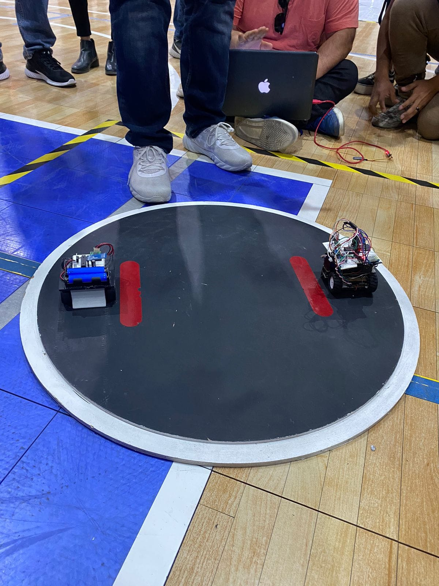
</p>

<p align="center">
  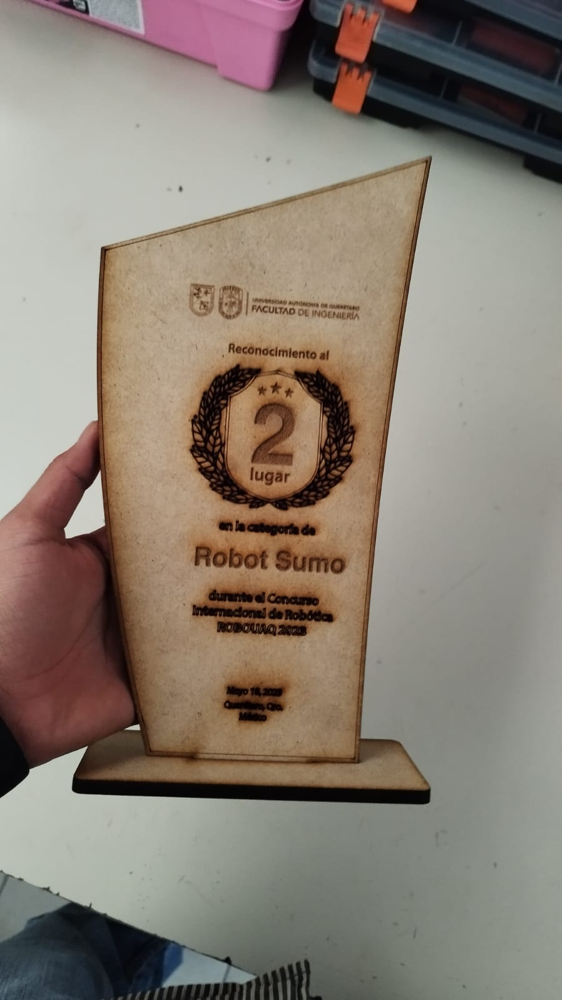
</p>

---

## Project Overview

The system consists of two embedded units:

1. A **wireless handheld controller** that reads joystick position and speed selection.
2. A **mini-sumo robot** that receives motion commands and controls two DC motors through a **TB6612FNG dual motor driver**.

The project combines:

- PIC18 embedded programming
- direct peripheral/register configuration
- ADC acquisition
- UART/Bluetooth communication
- command parsing
- PWM motor-speed control
- H-bridge direction control
- PCB design and assembly
- mechanical and electrical system integration

---

## System Architecture

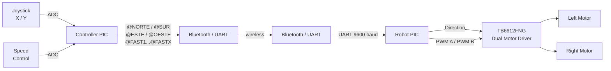

---

## Wireless Controller

The controller reads three analog inputs:

- joystick X axis;
- joystick Y axis;
- speed control.

The ADC values are divided into operating regions and translated into text commands.

### Direction Commands

```text
@ORIGEN
@NORTE
@ESTE
@SUR
@OESTE
```

### Speed Commands

```text
@FAST1
@FAST2
@FAST3
@FAST4
@FAST5
@FAST6
@FAST7
@FAST8
@FASTX
```

The commands are transmitted through UART at:

```text
9600 baud
8 data bits
No parity
```

The preserved controller firmware is available at:

```text
firmware/controller/controller.c
```

---

## Robot Firmware

The robot receives the wireless commands through its UART receive interrupt and interprets them as direction or speed instructions.

### Motor Direction

Commands such as:

```text
@NORTE
@ESTE
@SUR
@OESTE
```

change the digital control signals connected to the motor-driver inputs.

### Motor Speed

The firmware uses two CCP peripherals in PWM mode to control the two motor channels.

Different `FAST` commands modify the PWM command used for both motors.

Conceptually:

```text
Wireless command
      │
      ▼
PIC18
 ┌────┴───────────────┐
 │                    │
Direction          PWM duty
 │                    │
 ▼                    ▼
TB6612FNG dual motor driver
       │          │
       ▼          ▼
   Left motor  Right motor
```

The preserved robot firmware is available at:

```text
firmware/robot/robot.c
```

---

## Preserved Firmware Note

The physical system is remembered as using:

```text
Controller → PIC18F2550
Robot      → PIC18F4550
```

However, the recovered source files contain device headers corresponding to the opposite assignment.

For this reason, the repository organizes the firmware according to its **functional role** (`controller` and `robot`) rather than modifying the original recovered source code.

The recovered code is intentionally preserved without silently changing the target-device declarations.

---

## Controller Prototype

<p align="center">
  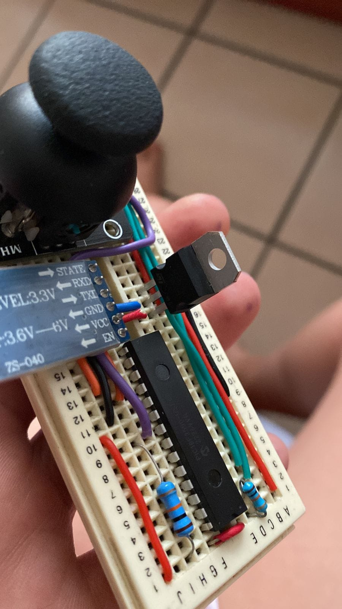
</p>

The controller combines the joystick, analog speed selection, PIC microcontroller, and Bluetooth communication interface.

---

## Robot Hardware

The robot electronics were integrated into a compact mini-sumo chassis with two DC gear motors and a front wedge.

<p align="center">
  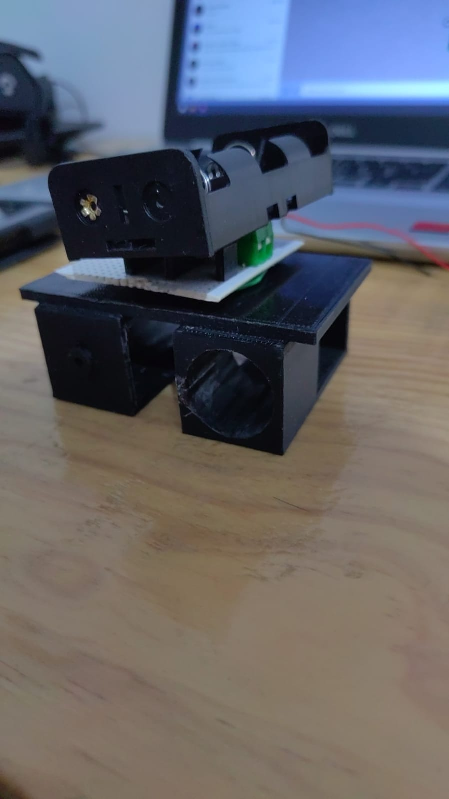
</p>

### Front Wedge

<p align="center">
  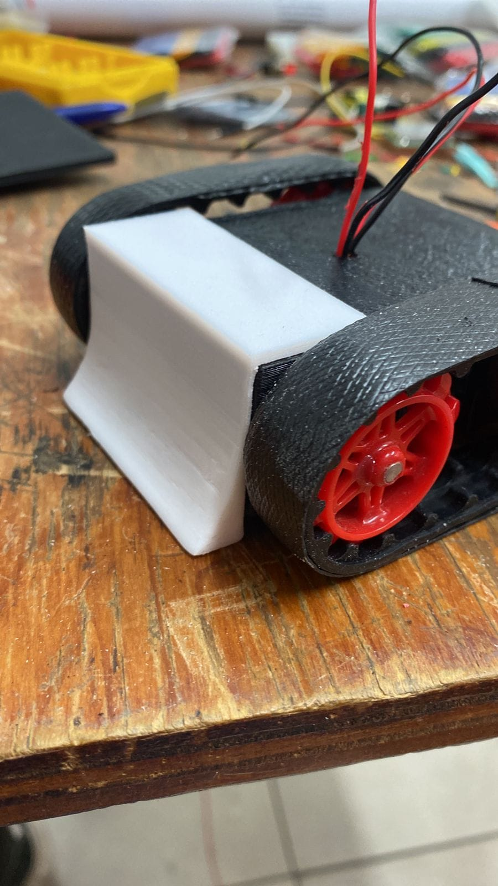
</p>

### Development Stage

<p align="center">
  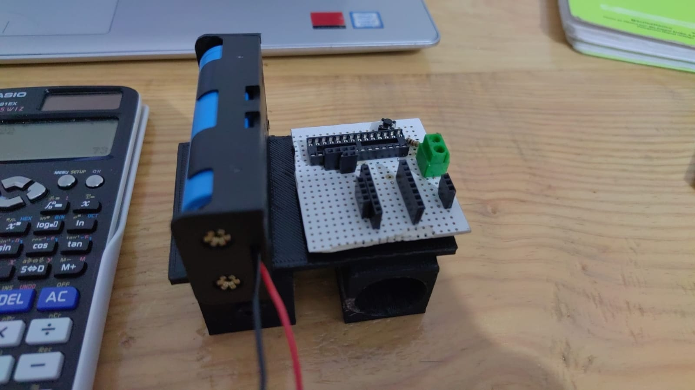
</p>

---

## Robot PCB

The robot PCB was designed specifically for the project.

The board was **designed by Leonardo López Ruiz**, manufactured externally, and later assembled and soldered manually.

### Schematic

<p align="center">
  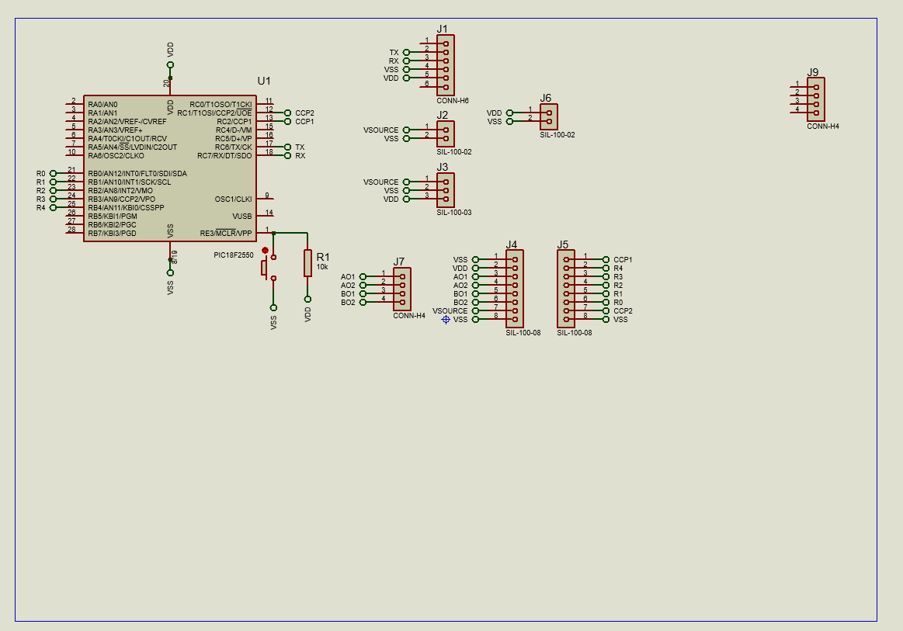
</p>

### PCB Layout

<p align="center">
  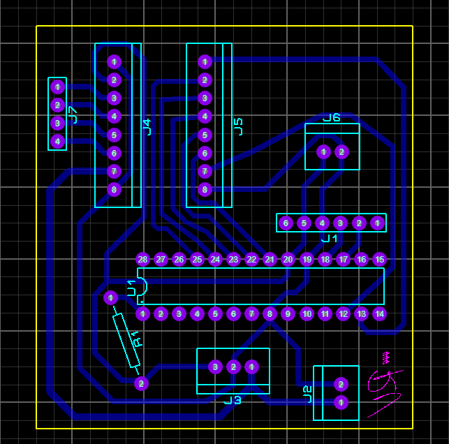
</p>

### 3D PCB

<p align="center">
  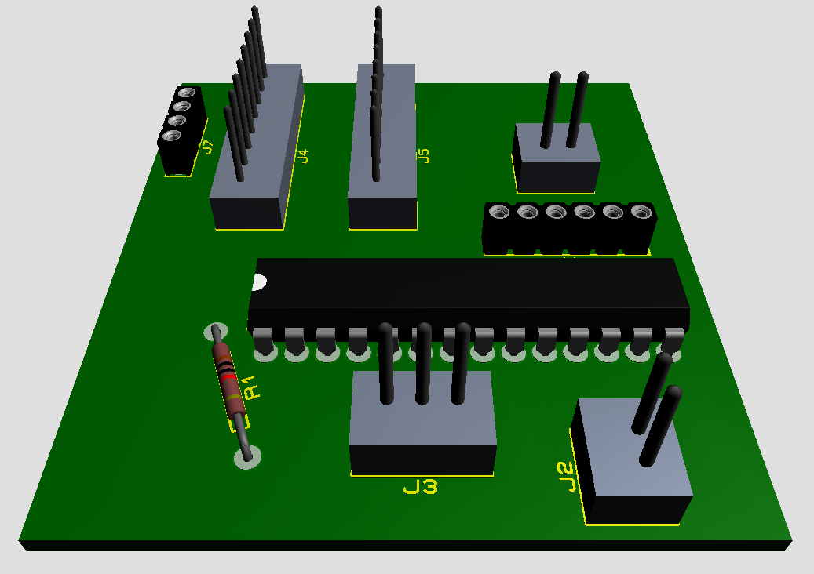
</p>

<p align="center">
  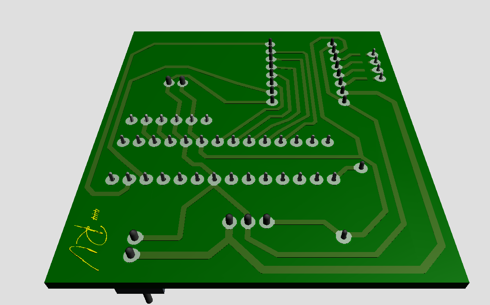
</p>

---

## Controller PCB and Proteus Design

Recovered Proteus projects for the controller are preserved in:

```text
hardware/controller/proteus/
```

The available design documentation includes the schematic, PCB artwork, layout, and physical controller prototype.

<p align="center">
  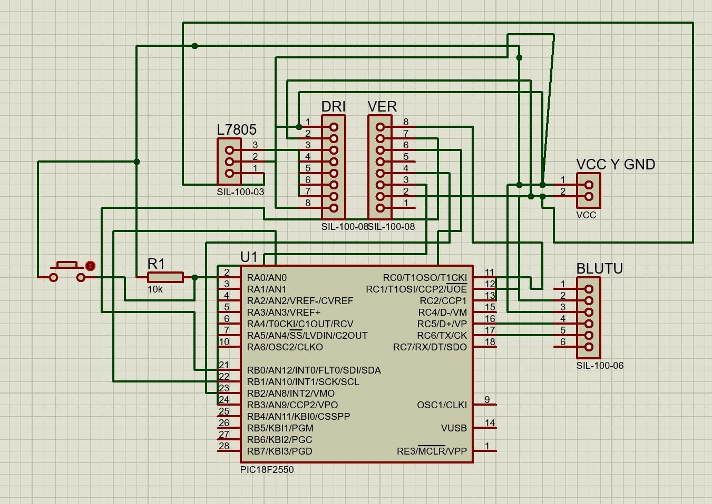
</p>

<p align="center">
  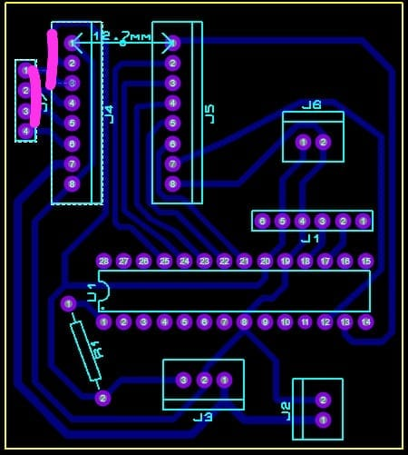
</p>

---

## Team Contributions

This was a collaborative project.

### Leonardo López Ruiz

- Firmware development for both PIC-based subsystems
- Direct peripheral/register configuration
- ADC joystick acquisition
- UART/Bluetooth command communication
- PWM motor-control implementation
- Robot PCB design
- PCB assembly and soldering
- Electronic-system integration

### Team contributions

Other team members contributed to:

- motor selection;
- battery selection and power-system considerations;
- selection of the **TB6612FNG** motor driver;
- mechanical/chassis design;
- physical robot construction and integration.

This repository distinguishes the contributions instead of presenting the complete project as individual work.

---

## Competition Result

The robot participated in **ROBOUAQ 2023** and obtained:

```text
2nd Place
Robot Sumo Category
ROBOUAQ 2023
```

<p align="center">
  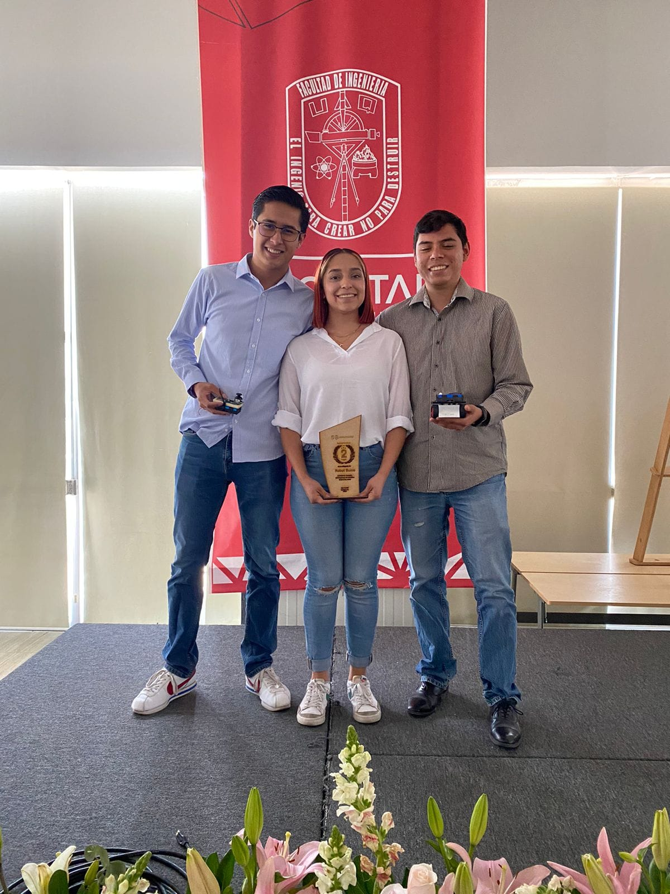
</p>

---

## Repository Structure

```text
PIC18F-Mini-Sumo-Robot/
│
├── firmware/
│   ├── controller/
│   │   └── controller.c
│   └── robot/
│       └── robot.c
│
├── hardware/
│   └── controller/
│       └── proteus/
│
├── images/
│   ├── competition/
│   ├── controller/
│   ├── pcb/
│   │   ├── controller/
│   │   └── robot/
│   └── robot/
│
├── docs/
│   └── reference/
│       └── robouaq_2026_mini_sumo_rules_reference.pdf
│
├── .gitignore
└── README.md
```

---

## Competition Rules Reference

The original **2023 Mini-Sumo rules were not recovered**.

A later ROBOUAQ Mini-Sumo rules document from 2026 is preserved only as a reference for the competition category:

```text
docs/reference/robouaq_2026_mini_sumo_rules_reference.pdf
```

It should **not** be interpreted as the exact rule set used during the 2023 competition.

---

## Tools and Technologies

### Embedded Systems

- PIC18 microcontrollers
- Embedded C
- Direct register configuration
- ADC
- UART
- Interrupt-based serial reception
- CCP PWM
- Timer2
- GPIO

### Robotics

- Differential-drive robot
- DC gear motors
- TB6612FNG dual motor driver
- Wireless manual control
- Multi-level speed control

### Communication

- Bluetooth serial communication
- UART at 9600 baud
- Text-based command protocol

### Electronic Design

- Proteus
- Schematic capture
- PCB layout
- Custom manufactured PCB
- Manual soldering and assembly

---

## Known Limitations

- The original 2023 competition rules were not recovered.
- The recovered source-code MCU declarations do not perfectly match the remembered final physical configuration.
- No complete original technical report was recovered.
- No quantitative characterization of wireless latency was preserved.
- No measured motor-speed or torque data was preserved.
- No current-consumption characterization was preserved.
- The recovered firmware represents the original academic implementation and was not refactored before publication.

---

## Possible Improvements

- Replace textual direction commands with a compact binary communication protocol.
- Add packet validation and checksum/CRC.
- Add communication-loss failsafe behavior.
- Add current sensing for both motors.
- Add battery-voltage monitoring.
- Add acceleration/deceleration ramps.
- Refactor direction and speed handling into a state machine.
- Use timer-driven non-blocking communication.
- Add telemetry from the robot to the controller.
- Characterize motor current and battery runtime.
- Document the final bill of materials.
- Recreate the complete robot PCB project from the preserved schematic and images.

---

## Academic Context

Developed during the **Microsistemas** course in the Automation Engineering program at the **Universidad Autónoma de Querétaro**.

The project provided practical experience in embedded programming, direct peripheral configuration, wireless communication, motor control, PCB design, electronics assembly, teamwork, and competitive robotics.

---

## Author

**Leonardo López Ruiz**  
Automation Engineering — Electronics and Embedded Systems